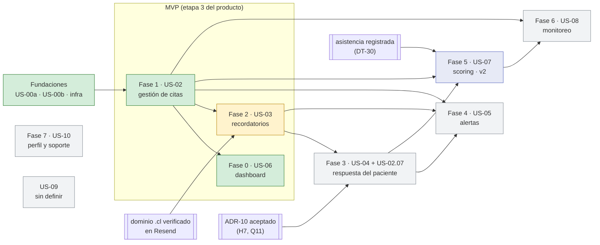

# Fases del roadmap

Puerta de entrada **por fases de construcción**. Cada fase tiene un documento que junta en un solo
lugar todo lo que la toca —ADRs, features, deudas, decisiones del frontend, planes de US, preguntas
abiertas y commits— y dice en qué orden leerlo. Los documentos de origen no se mueven: esta carpeta
es solo navegación, y cada ADR, feature, deuda, US y FD enlaza de vuelta a su fase.

> **Dos sentidos de "fase". Léelo antes de seguir.**
>
> - **Fases del roadmap** (esta carpeta): etapas de **construcción**. Fundaciones, Fase 0 … Fase 7 y
>   US-09. La fuente del estado es [`ROADMAP.md`](../ROADMAP.md).
> - **Etapas del producto** ([`Descripcion/`](../Descripcion/README.md)): cómo se llegó al alcance
>   —problema, validación, requisitos y MVP—. Sus archivos se llaman `fase-0-problema.md` …
>   `fase-3-mvp.md` por historia, pero **no** son fases del roadmap.
> - **Un tercer uso, local a algunos ADR:** ADR-08 divide su plan en "fase 1" (segmento de ruta) y
>   "fase 2" (subdominio); ADR-09 llama "Fase 1" a pedir hora y "Fase 2" al modelo de disponibilidad, y
>   su §7 habla de la "fase 2" del adaptador de hechos. Esas fases son **del ADR**, no del roadmap.
>
> Equivalencia útil: la **etapa 3 del producto (MVP)** son las **fases 0, 1 y 2 del roadmap**.

**Estado al 2026-09-30** (según el [ROADMAP](../ROADMAP.md#resumen)): Fundaciones, Fase 0 y Fase 1
cerradas en `develop` · Fase 2 con el diseño cerrado y sin implementar (su commit de diseño,
`ab30bb7`, está solo en la rama `docs/fase2-recordatorios`) · el resto sin empezar.

---

## Índice

Los números de commit remiten a las filas de [`TRAZABILIDAD.md`](../TRAZABILIDAD.md). "Afectadas" =
deudas que la fase cambió de estado sin crearlas ni cerrarlas.

| Fase | US | Estado | Fechas | Features | ADRs | Deudas | FDs | Planes de US | Commits | Depende de |
|---|---|---|---|---|---|---|---|---|---|---|
| [Fundaciones](fase-base-fundaciones.md) | US-00a, US-00b, infraestructura | ✅ cerrada | 2026-06-18 → 2026-06-29 · tooling y ADR-08 el 2026-08-16 | [us00a](../Features/us00a-registro-inicial.md), [us00b](../Features/us00b-login.md), [infra](../Features/infra-contenedores.md) | 00, 01, 02, 03, 05, 06 · 08 (propuesto) | **creadas:** DT-01…09, DT-18, DT-19, DT-21 · **cerradas:** — | — | [US-00](../US/00-auth.md) | filas 1–19 y 26–34 (`258542f` → `bfeada0`) | — |
| [Fase 0](fase-0-us06-dashboard.md) | US-06 dashboard | ✅ cerrada (2026-09-28) | backend 2026-06-30 · zona horaria 2026-07-06 · conexión real 2026-09-28 | [us06](../Features/us06-dashboard-citas.md) | 04, 07 | **creadas:** DT-10…17, DT-20, DT-22 · **cerradas:** — (DT-10 y DT-22 se cierran en la Fase 1) | — | [US-06](../US/06-epic.md) | filas 20–25 y 28 (`9ab2bec` → `08dad63`, `f200557`) | Fundaciones · Fase 1 (lista real, voucher) |
| [Fase 1](fase-1-us02-gestion-citas.md) | US-02 gestión de citas (+ US-02.07 ⏸, 02.08, 02.09) | ✅ cerrada (2026-09-28) | release 1 2026-08-24 · vía pública 2026-09-10 · cierre 2026-09-28 · decisiones 2026-09-29 | [us02](../Features/us02-gestion-citas.md) | 09, 11 · 10 (propuesto, aplazado) · 08 (su fase 1, en la ruta pública) | **creadas:** DT-23…29 · **cerradas:** DT-10, DT-22 · **mitigada:** DT-28 · **afectadas:** DT-12, DT-14, DT-15, DT-18, DT-20 | FD-01 (descartada), FD-02…05 | [US-02.07](../US/02.07-paciente-reagenda-cancela.md), [US-02.08](../US/02.08-voucher-cita.md) | filas 35–39 y 41–58 (`f2a7dff` → `c9ac69f`) | Fundaciones (el ROADMAP no le pone dependencias; reutiliza `Cita` y `Paciente` de la Fase 0) |
| [Fase 2](fase-2-us03-recordatorios.md) | US-03 recordatorios | 🔶 diseño cerrado · sin implementar · **en el MVP** | diseño 2026-09-30 | — (diseñada, sin feature) | 12, 13 | **creada:** DT-30 · **resueltas en diseño:** DT-19, DT-21, DT-27 · **afectadas:** DT-11, DT-16, DT-17, DT-23, DT-26, DT-29 | — | [US-03](../US/03-recordatorios.md) | fila 59 (`ab30bb7`) | Fase 1 · dominio verificado en Resend |
| [Fase 3](fase-3-us04-respuesta-paciente.md) | US-04 respuesta del paciente (+ US-02.07) | ⬜ fuera del MVP | — | — | 10 (propuesto) · 13 (bloque `accion`) | **afectadas:** DT-11, DT-16, DT-18, DT-23, DT-30 (se reabre) | FD-06 (propuesta) | [US-02.07](../US/02.07-paciente-reagenda-cancela.md) | — | Fase 2 · ADR-10 aceptado (H7, Q11) |
| [Fase 4](fase-4-us05-alertas.md) | US-05 alertas | ⬜ solo el puerto | — | — | 12 §4 (suscriptores) · 09 §7 | **afectada:** DT-28 | — | — | — | Fases 1, 2 y 3 |
| [Fase 5](fase-5-us07-scoring.md) | US-07 scoring | ⏸ v2 (fuera del MVP) | — | — | 04 §4 · 12 §8 | **afectadas:** DT-11, DT-13, DT-23, DT-30 | — | — | — | Fases 1 y 3 · proceso de cierre (ADR-12) · DT-30 |
| [Fase 6](fases-6-7-us09-sin-diseno.md#fase-6--us-08-monitoreo-y-seguimiento-del-paciente) | US-08 monitoreo | 🔶 solo `POST /pacientes` | — | — | — | — | — | — | — | Fases 1 y 5 |
| [Fase 7](fases-6-7-us09-sin-diseno.md#fase-7--us-10-perfil-suscripción-y-soporte) | US-10 perfil y soporte | ⬜ | — | — | — | — | — | — | — | — |
| [US-09](fases-6-7-us09-sin-diseno.md#us-09--sin-definir) | sin definir | ⬜ | — | — | — | — | — | — | — | — |

Fila 40 de la trazabilidad (`cea0bd1`, creación del ROADMAP) es **transversal**: no pertenece a una
fase.

---

## Dependencias entre fases

Solo las aristas que declara el [ROADMAP](../ROADMAP.md#resumen) (más Fundaciones como base). En
rectángulo doble, los prerrequisitos que no son fases.

**Cómo leer el diagrama.** La Fase 0 depende de la Fase 1 aunque se construyó primero: su backend
(junio) creó `Cita`, `Paciente` y `POST /citas`, pero el dashboard solo quedó cerrado cuando la
Fase 1 entregó la lista real, el voucher (US-02.08) y el refresco tras cada cambio (US-02.09). La
Fase 7 y US-09 no dependen de nada según el ROADMAP. La Fase 6 depende de US-07 (la Fase 5), no de
la subtarea US-02.07.

---

## Qué no pertenece a ninguna fase

| Documento | Por qué es transversal |
|---|---|
| [`rf.md`](../rf.md) · [`rnf.md`](../rnf.md) | requisitos; cada fase cita los suyos |
| [`rules.md`](../rules.md) · [ADR-02](../Decisions/ADR-02.md) | reglas de código que aplican a todas |
| [`stack-tecnologico.md`](../stack-tecnologico.md) | stack y despliegue; la Fase 2 lo actualizó el 2026-09-30 |
| [`PREGUNTAS-ABIERTAS.md`](../PREGUNTAS-ABIERTAS.md) | Q2 (prepago), Q3 (agenda de la organización) y Q10 (validación) no son de ninguna fase |
| [`Descripcion/`](../Descripcion/README.md) | etapas del producto (ver arriba) |

---

## Convenciones de esta carpeta

- **Un documento por fase** con el nombre `fase-<n>-<us>-<tema>.md`; `fase-base-` para Fundaciones.
  Las fases 6, 7 y US-09 comparten [un documento](fases-6-7-us09-sin-diseno.md) porque no tienen ADR,
  FD, plan, feature ni commit propios; cuando alguna los tenga, se separa en su archivo.
- **El estado vive en el ROADMAP**, no aquí. Si un documento de fase contradice al ROADMAP, manda el
  ROADMAP y hay que corregir la fase.
- **Bloque de navegación.** Cada ADR, feature, deuda, US y FD lleva bajo el título una línea
  `**Fase:** … · **Feature:** … · **Plan:** … · **Relacionado:** …`. Al crear un documento nuevo,
  agrégala y suma el documento a la sección correspondiente de su fase.
