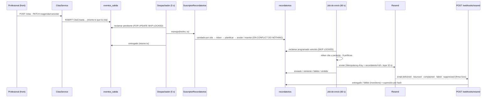

# Feature: US-03 — Recordatorios al paciente por correo (+ outbox, planificador y observabilidad)

> **Fase:** [Fase 2 — US-03](../Fases/fase-2-us03-recordatorios.md) · **Feature:** este documento · **Plan:** [US-03](../US/03-recordatorios.md) · **Relacionado:** [ADR-12](../Decisions/ADR-12.md), [ADR-13](../Decisions/ADR-13.md), [ADR-02](../Decisions/ADR-02.md), [DT-16](../Deudas/DT-16.md), [DT-19](../Deudas/DT-19.md), [DT-21](../Deudas/DT-21.md), [DT-27](../Deudas/DT-27.md), [DT-31](../Deudas/DT-31.md)…[DT-41](../Deudas/DT-41.md), [recordatorios (front)](../../../citia-frontend/context/Features/recordatorios.md)

**Historia:** US-03 (RF-06; RNF-02, RNF-03, RNF-08)
**Estado:** ✅ **en producción** desde el release del 2026-10-06 y **verificada de punta a punta** con un
correo real el 2026-10-07 ([§ En producción](#en-producción-2026-10-07)) · implementada el 2026-10-04 y
mergeada a `develop` ese día ([PR #1](https://github.com/Citia-solutions/citia-backend/pull/1), con el
frontend en [PR #2](https://github.com/Citia-solutions/citia-frontend/pull/2)) · 1274 unitarios, 212 e2e y
80 de integración en verde
**Commits:** `daf0617`, `a6c237f`, `d45de20`, `f95b637`, `db46e37` (outbox, planificador y
observabilidad) · `a37f175` (correo del paciente) · `f2d80aa`, `a13d80a`, `f719c66` (recordatorios) ·
`a938f9d` (Definición de Terminado) · `8dd4747` (coverage) · merge a `develop` `060303c` · release a
`main` `c057ade`
**ADRs:** **[12](../Decisions/ADR-12.md)** (outbox + planificador) · **[13](../Decisions/ADR-13.md)**
(recordatorios) · nota en [02](../Decisions/ADR-02.md) · se apoya en [04](../Decisions/ADR-04.md),
[06](../Decisions/ADR-06.md), [07](../Decisions/ADR-07.md), [09 §3–§4](../Decisions/ADR-09.md)

> Las decisiones están en los dos ADR; sus desvíos, en la sección *Notas de implementación* de cada
> uno ([ADR-12](../Decisions/ADR-12.md#notas-de-implementación-2026-10-04),
> [ADR-13](../Decisions/ADR-13.md#notas-de-implementación-2026-10-04)). Este documento describe **lo
> que existe en el código**. Las reglas locales para los agentes viven en
> `src/modules/recordatorio/CLAUDE.md`.

---

## Qué hace

> *Como profesional de la salud quiero que mis pacientes reciban un recordatorio automático por correo
> antes de su hora, para no tener que escribirles yo.*

- Cada cita vigente recibe **recordatorios por correo** según la configuración de su profesional: por
  defecto **24 h y 2 h antes**, de 1 a 3 momentos entre 30 min y 7 días.
- **Reagendar** los reprograma, **cancelar o cerrar** la cita los anula, **editar** no los toca. Nadie
  lo pide a mano: lo hace el sistema a partir de los hechos de dominio, por un **outbox transaccional**.
- No se envía entre las **21:00 y las 08:00** (hora de la clínica): un recordatorio que caería ahí se
  **adelanta** a las 20:59.
- El correo lleva **solo** fecha, hora, profesional, organización y cómo contactar; asunto neutro, sin
  datos del paciente ni tipo de consulta, sin seguimiento de aperturas ni clics.
- El profesional ve el **estado de cada recordatorio** en el voucher (programado, enviado, entregado,
  fallido, cancelado, omitido) y el motivo cuando no salió.
- El **correo del paciente pasa a ser obligatorio** al crearlo, y aparece `PATCH /api/pacientes/:id`
  para completar los que quedaron sin correo.
- El equipo se entera de un fallo **antes que el cliente**: logs JSON, health check, latidos y alertas
  por log para Better Stack.

Infraestructura nueva que estrena esta feature y que otras fases reutilizan: el **outbox**
`eventos_salida` con su despachador ([ADR-12](../Decisions/ADR-12.md), cierra [DT-27](../Deudas/DT-27.md)),
el **planificador en proceso** y la **observabilidad** ([DT-19](../Deudas/DT-19.md)).

---

## Arquitectura (hexagonal)

### Módulo `recordatorio/` (rehecho; cierra [DT-21](../Deudas/DT-21.md))

```
src/modules/recordatorio/
├── domain/                                    ← TypeScript puro (src/arquitectura.spec.ts lo vigila)
│   ├── recordatorio.entity.ts                 ← 6 estados, 14 motivos emparejados, transiciones con guarda
│   ├── configuracion-recordatorio.entity.ts   ← 1 a 3 antelaciones (30…10.080 min), contacto, predeterminada
│   ├── planificacion.ts                       ← planificar (a–d) y resolverTardios (e–f): funciones puras
│   ├── reconciliacion.ts                      ← qué anular y qué insertar para una cita (pura)
│   ├── horas-sin-envio.ts · periodos-conteo.ts · hash-correo.ts
│   ├── politicas-envio.ts                     ← las 9 políticas, en orden
│   ├── reintentos-envio.ts                    ← calendario 1, 5, 15, 30, 60 min acotado por venceEn
│   ├── canal-mensajeria.ts                    ← puerto CanalMensajeria + 6 resultados + claveIdempotencia
│   ├── lector-citas.ts                        ← puerto de SOLO LECTURA sobre cita/paciente/usuario/tenant
│   └── recordatorio · configuracion-recordatorio · supresion-correo .repository.ts  ← puertos (tx obligatorio)
├── application/
│   ├── suscriptor-recordatorios.ts            ← SuscriptorEventos del outbox
│   ├── reconciliar-recordatorios.service.ts   ← reconcilia UNA cita (candado por cita)
│   ├── reconciliacion-respaldo.service.ts     ← barrido horario de citas sin recordatorio
│   ├── enviar-recordatorios.service.ts        ← reclamo + políticas + envío, un tx por recordatorio
│   ├── plantilla-recordatorio.ts              ← asunto, HTML escapado y texto; bloque accion? (Fase 3)
│   ├── procesar-webhook-entrega.service.ts    ← eventos de entrega monótonos + supresión
│   ├── tasa-fallo-recordatorios.service.ts    ← fallidos ÷ (entregados + fallidos) en 24 h
│   ├── configuracion-recordatorios.service.ts ← GET/PUT; publica ConfiguracionRecordatorioActualizada
│   ├── consultar-recordatorios.service.ts     ← estado de los recordatorios de una cita
│   ├── bitacora-recordatorios.ts              ← puerto de logs con nombre estable
│   └── avisos-por-periodo.ts                  ← "una vez por periodo y proceso"
├── infrastructure/
│   ├── persistence/                           ← entidades ORM, adaptadores SQL, SqlLectorCitas
│   ├── mensajeria/                            ← ResendCanalMensajeria, RegistroCanalMensajeria,
│   │                                            crear-canal-mensajeria, verificador Svix, eventos-resend
│   ├── observabilidad/bitacora-recordatorios-logger.ts
│   ├── config/opciones-recordatorios.ts
│   └── planificacion/planificador-recordatorios.ts  ← jobs: envío, respaldo, tasa de fallo
├── presentation/                              ← 3 controllers + dto/
├── integration/                               ← tests contra Postgres
├── recordatorio.module.ts                     ← persistencia, casos de uso, controllers, suscriptor
├── recordatorio-planificacion.module.ts       ← SOLO los jobs (lo importa solo AppModule)
└── CLAUDE.md
```

### Piezas compartidas (`src/shared/`)

```
src/shared/
├── application/
│   ├── publicador-eventos.ts          ← publicar(evento, tx): el tx es obligatorio
│   ├── eventos-salida.repository.ts   ← puerto del outbox (BARRIDO GLOBAL marcado)
│   ├── suscriptor-eventos.ts          ← puerto de los suscriptores
│   ├── politica-reintento-salida.ts   ← 10 s → 20 s → … → 1 h, variación hacia abajo (pura)
│   └── latidos.ts                     ← puerto de heartbeats (nunca lanza)
├── domain/correo.ts                   ← normalizarCorreo (trim + minúsculas)
├── infrastructure/
│   ├── salida/                        ← PublicadorEventosEnSalida, DespachadorEventosSalida,
│   │                                    RegistroSuscriptores, PurgaEventosSalida, adaptador TypeORM
│   ├── planificacion/                 ← PlanificadorSalida, TrabajoSinSolapamiento
│   ├── observabilidad/                ← opciones-logger (pino + redacción), latidos-better-stack
│   └── config/                        ← entorno.ts (validación), origenes-cors.ts
├── presentation/
│   ├── salud.controller.ts            ← GET /api/health
│   └── normalizar-correo.decorator.ts ← @NormalizarCorreo() para los DTO
├── observabilidad.module.ts           ← @Global: LoggerModule (pino), SaludController, Latidos
└── planificacion.module.ts            ← ScheduleModule.forRoot() + PlanificadorSalida
```

### Reglas de dependencia

- **`cita` no sabe que `recordatorio` existe.** Se comunican solo por hechos del outbox. Ningún módulo
  importa `RecordatorioModule`.
- **`recordatorio` lee, nunca escribe,** las tablas de `cita`, `paciente`, `usuario` y `tenant`, con
  `SqlLectorCitas` (proyección SQL de solo lectura). Coste aceptado: depende de su **esquema**.
- **`tx` obligatorio en todos los puertos**, también para leer; los adaptadores lanzan sin él.
- **BARRIDO GLOBAL** (sin filtro de tenant, marcado con ese comentario): reclamar, contar (cuota,
  desenlaces), el respaldo y el webhook. Solo los usan los jobs y el webhook; tras tomar una fila, todo
  usa su `tenantId`. Ninguna ruta autenticada barre tenants.
- La configuración que se aplica es la del **dueño de la cita** (`cita.usuarioId`), nunca el
  `usuarioId` del payload del hecho (es quien hizo la petición).
- `domain/` y `application/` sin Nest, TypeORM ni `class-validator`: lo comprueba `src/arquitectura.spec.ts`.
  `recordatorio` no tiene servicios que importen DTOs de `presentation/` ([DT-31](../Deudas/DT-31.md)).

---

## Flujo de punta a punta



1. **Outbox.** Cada caso de uso de cita (crear, aceptar una solicitud, confirmar, cancelar, asistencia,
   inasistencia, reagendar, editar) llama a `publicar(evento, tx)`, que escribe el hecho en
   `eventos_salida` **en la misma transacción**. O existen los dos o ninguno.
2. **Despachador** (cada 5 s, todos los tenants). Reclama un hecho por transacción con
   `FOR UPDATE SKIP LOCKED`, ejecuta sus suscriptores con ese mismo `tx` y lo marca `entregado`. Si un
   suscriptor lanza, se revierte todo y se registra el fallo aparte con espera creciente; al décimo,
   `fallido` y alerta `eventos_salida.fallido`.
3. **Suscriptor y reconciliación.** `SuscriptorRecordatorios` escucha los siete hechos de cita y
   `ConfiguracionRecordatorioActualizada`. **No aplica deltas**: toma el candado consultivo de la cita,
   la relee con el `tenant_id` del hecho, lee la configuración de su dueño, calcula lo que debería
   existir (`planificar` + `resolverTardios`) y anula o inserta lo que falte. Repetir o desordenar hechos
   no cambia el resultado.
4. **Respaldo** (cada hora, minuto 15). Reconcilia las citas vigentes de los próximos 8 días **sin
   ningún recordatorio para su inicio actual**: cubre las citas anteriores al despliegue, un hecho
   muerto en el outbox o un error de programación.
5. **Envío** (cada 60 s, lote de 20). Reclama el `programado` más antiguo cuyo `proximo_intento_en` ya
   pasó, relee todo con el `tenant_id` de la fila, evalúa las 9 políticas y, si toca, genera la
   plantilla **en ese momento** y llama a `CanalMensajeria`. La transacción queda abierta durante la
   llamada (deliberado: si el proceso muere tras la aceptación, la `Idempotency-Key` absorbe el
   reintento). 500 ms de pausa entre llamadas.
6. **Webhook.** Resend avisa la entrega; el webhook verifica la firma sobre el cuerpo crudo y actualiza
   la fila de forma **monótona** (un evento repetido o fuera de orden no cambia nada). Un rebote
   permanente, una queja o `email.suppressed` suprimen la dirección.

### Planificación (funciones puras)

- `programado_para = inicio − antelación` en instantes (24 h son 24 horas reales; la noche del cambio de
  horario cae una hora antes o después en el reloj de pared, y se acepta).
- Si cae en horas sin envío (`[21:00, 08:00)` en `APP_TZ`), se **adelanta** al último minuto permitido.
- Dos recordatorios a menos de 30 min entre sí se **fusionan**: queda el de menor antelación y el otro
  nace `omitido` (`fusionado`).
- **Vencimiento:** cada uno vence cuando toca el siguiente; el último,
  `max(inicio − margen, min(inicio, programadoPara + margen))` con `margen = 30 min`.
- **Cita creada tarde:** si un momento ya pasó y otro sigue en el futuro, el pasado nace `omitido`
  (`creada_tarde`). Si **ninguno** queda en el futuro, sale **uno solo** (el de menor antelación) lo
  antes posible fuera del silencio, siempre que a esa hora falten **≥ 60 min** para la cita y que no
  haya salido ya otro para ese inicio; si no, todos `omitido`.
- Nada que planificar si la cita no está vigente, si la configuración está apagada o si
  `inicio − 30 min ≤ ahora` (incluye citas agendadas en el pasado).

### Las nueve políticas del envío (en orden)

| # | Política | Si no se cumple |
|---|---|---|
| 1 | La cita existe, está vigente y su `inicio` es el del recordatorio | `cancelado` (`cita_terminal` / `reprogramado`) |
| 2 | `ahora < vence_en` | `fallido` (`vencido`) |
| 3 | Configuración del dueño activa | `cancelado` (`desactivado`) |
| 4 | Fuera de las horas sin envío | se pospone al fin del silencio si queda antes de `vence_en`; si no, `fallido` (`vencido`) |
| 5 | El paciente tiene correo | `omitido` (`sin_correo`) |
| 6 | La dirección no está suprimida | `omitido` (`correo_suprimido`) |
| 7 | Consentimiento — **apagada** (`RECORDATORIO_EXIGIR_CONSENTIMIENTO=false`, [DT-16](../Deudas/DT-16.md)) | `omitido` (`sin_consentimiento`) |
| 8 | Tope diario del tenant (40, día de la clínica) | `omitido` (`limite_tenant`) |
| 9 | Cuota local del proveedor (100/día, 3.000/mes, UTC) | se pospone al reinicio si llega antes de `vence_en`; si no, `fallido` (`cuota_agotada`) |

### Resultado del proveedor → efecto

| Resultado (`CanalMensajeria`) | Ejemplos en Resend | Efecto |
|---|---|---|
| `aceptado` | 200 con `id` | `enviado`, guarda `proveedor_mensaje_id` |
| `transitorio` | 5xx, tiempo agotado, red, 429 `rate_limit_exceeded`, 409 concurrente | reintento a 1, 5, 15, 30 y 60 min (`RECORDATORIO_MAX_INTENTOS` = 5 reintentos), el último adelantado a `vence_en − 1 min`; agotado → `fallido` (`vencido`) |
| `cuota_agotada` | 429 `daily_quota_exceeded` / `monthly_quota_exceeded` | se pospone al reinicio (día o mes UTC) o `fallido` (`cuota_agotada`); corta el lote; el proceso deja de llamar hasta el reinicio (en memoria); alerta |
| `permanente` | 400/422 sobre `to` → `correo_invalido`; otro 4xx → `rechazado` | `fallido`, sin reintento; **no suprime** |
| `configuracion` | 401/403 (también dominio no verificado), 404/405, `invalid_idempotency_key`, remitente inválido | no toca la fila ni suma intento; corta el lote; alerta `recordatorios.configuracion` e informa fallo al latido |
| `posible_duplicado` | 409 `invalid_idempotent_request`, 200 sin `id` | `enviado` sin id; el webhook `email.sent` lo completa |

Un error **interno** al procesar una fila se registra como reintento con código `interno:<name>` y el
lote sigue.

### Máquina de estados del recordatorio

| Desde | Evento | Hacia | Motivo |
|---|---|---|---|
| — | planificado con su hora en el futuro (o tardío) | `programado` | — |
| — | planificado con su hora pasada, o fusionado | `omitido` | `creada_tarde` · `fusionado` |
| `programado` | el proveedor lo aceptó | `enviado` | — |
| `programado` · `enviado` | webhook `delivered` | `entregado` | — |
| `programado` · `enviado` | webhook rebote permanente / `suppressed` | `fallido` | `rebote` |
| `programado` · `enviado` | webhook `failed` | `fallido` | `rechazado` |
| `programado` | la cita pasó a terminal · se reagendó o cambió la configuración · se apagó | `cancelado` | `cita_terminal` · `reprogramado` · `desactivado` |
| `programado` | una política lo impidió | `omitido` | `sin_correo` · `correo_suprimido` · `limite_tenant` · `sin_consentimiento` |
| `programado` | error permanente · venció · cuota | `fallido` | `correo_invalido` · `rechazado` · `vencido` · `cuota_agotada` |
| `enviado` · `entregado` | webhook `complained` | (sin cambio; fija `queja_en`) + supresión | — |

**Para RNF-03 solo cuenta `fallido`**: `cancelado` (la cita cambió) y `omitido` (una regla decidió no
enviarlo) no son fallos del servicio.

---

## Endpoints

Prefijo global `/api`. Todas las rutas autenticadas toman `tenantId` y `usuarioId` **del token**; el
`ValidationPipe` global (`whitelist`, `transform`) descarta campos desconocidos.

| Método | Ruta | Guard | Respuestas |
|--------|------|-------|-----------|
| `GET` | `/api/recordatorios/configuracion` | JWT | 200 · 401 |
| `PUT` | `/api/recordatorios/configuracion` | JWT | 200 · 400 · 401 |
| `GET` | `/api/citas/:citaId/recordatorios` | JWT | 200 · 400 (no UUID) · 401 · 404 (inexistente u otro tenant) |
| `POST` | `/api/webhooks/resend` | firma Svix (público) | 200 · 400 uniforme · 500 (Resend reintenta) |
| `GET` | `/api/health` | — (público) | 200 · 503 |
| `PATCH` | `/api/pacientes/:id` | JWT | 200 · 400 · 401 · 404 |
| `POST` | `/api/pacientes` · `/api/citas` | JWT | **cambia:** `correo` obligatorio → 400 si falta |

### `GET /api/recordatorios/configuracion`

La del profesional del token; si nunca guardó, la predeterminada del entorno con `predeterminada: true`.

```json
{
  "activo": true,
  "canal": "email",
  "antelacionesMin": [1440, 120],
  "telefonoContacto": null,
  "correoRespuesta": null,
  "predeterminada": true
}
```

`antelacionesMin` va de mayor a menor. Sin ids, `tenantId` ni `usuarioId`.

### `PUT /api/recordatorios/configuracion`

**Reemplazo completo:** lo que no viaja, o viaja `null` o vacío, queda `null`. El `canal` no se recibe.

```json
{
  "activo": true,
  "antelacionesMin": [2880, 120],
  "telefonoContacto": "+56 9 1234 5678",
  "correoRespuesta": "consulta@ana.cl"
}
```

| Campo | Regla |
|---|---|
| `activo` | booleano, obligatorio |
| `antelacionesMin` | arreglo de 1 a 3 enteros **distintos** entre 30 y 10.080 |
| `telefonoContacto` | texto opcional, hasta 30 caracteres; se recorta; vacío → `null` |
| `correoRespuesta` | correo opcional, hasta 254; se normaliza (trim + minúsculas); vacío → `null` (el correo dirá que no recibe respuestas) |

- **200** con la misma forma del GET (`predeterminada: false`). En la misma transacción publica
  `ConfiguracionRecordatorioActualizada` (`{ usuarioId }`): las citas futuras vigentes del profesional se
  reprograman o se anulan **de forma asíncrona** (unos segundos).
- **400**: el del `ValidationPipe` (`message` es un arreglo) o el del dominio (`message` nombra el campo
  y la regla, nunca el valor).

### `GET /api/citas/:citaId/recordatorios`

Los recordatorios de la cita (incluidos los `cancelado`), por `programadoPara`. Lo sirve este módulo,
no `cita`.

```json
[
  {
    "id": "6f1c…",
    "canal": "email",
    "antelacionMin": 1440,
    "estado": "entregado",
    "motivo": null,
    "programadoPara": "2026-10-13T13:30:00.000Z",
    "proximoIntentoEn": null,
    "enviadoEn": "2026-10-13T13:30:04.000Z",
    "entregadoEn": "2026-10-13T13:30:09.000Z"
  },
  {
    "id": "9a2d…",
    "canal": "email",
    "antelacionMin": 120,
    "estado": "programado",
    "motivo": null,
    "programadoPara": "2026-10-14T11:30:00.000Z",
    "proximoIntentoEn": "2026-10-14T11:30:00.000Z",
    "enviadoEn": null,
    "entregadoEn": null
  }
]
```

- `motivo`: código cuando no salió (`cancelado`, `omitido`, `fallido`); si no, `null`.
- `proximoIntentoEn`: la hora real del próximo intento **solo mientras está `programado`** (difiere de
  `programadoPara` en un tardío, un reintento o una espera por silencio o cuota); `null` en otro estado.
- **No trae** destinatario (no se guarda), `proveedor`, `proveedorMensajeId`, `ultimoError` ni
  `intentos`.

### `POST /api/webhooks/resend`

Público: lo autentica la **firma Svix** (`svix-id`, `svix-timestamp`, `svix-signature`) sobre
`req.rawBody` (`rawBody: true` en `main.ts`), con el secreto `RESEND_WEBHOOK_SECRET`.

| Caso | Respuesta |
|---|---|
| Firma válida | `200 { "recibido": true }` |
| Firma inválida, sello de más de 5 min o cabeceras ausentes | `400` uniforme (`"Firma de webhook inválida"`), sin tocar nada |
| Evento sin efecto (`delivery_delayed`, rebote no permanente, aperturas, clics…) | 200, solo log |
| Id desconocido (p. ej. un correo de prueba) | 200, se ignora |
| Evento repetido o fuera de orden | 200, sin cambios |
| Falla la base | 500 (Resend reintenta) |

Busca la fila por la etiqueta `recordatorio_id` (`data.tags`, que llega como objeto) y, si falta, por
`proveedor_mensaje_id`. Si la fila está tomada por un envío en curso, espera al commit.

| Evento de Resend | Efecto |
|---|---|
| `email.sent` | completa `proveedor_mensaje_id` si faltaba |
| `email.delivered` | `programado`/`enviado` → `entregado` |
| `email.bounced` con `bounce.type = Permanent` | → `fallido` (`rebote`) + supresión |
| `email.bounced` de otro tipo | solo log |
| `email.complained` | fija `queja_en` + supresión (el estado no cambia) |
| `email.failed` | → `fallido` (`rechazado`) |
| `email.suppressed` | como un rebote: → `fallido` (`rebote`) + supresión |

### `GET /api/health`

Para el monitor de uptime. Público, `Cache-Control: no-store`, sin log por petición.

- **200** `{ "estado": "ok", "baseDatos": "ok" }` si Postgres responde a `SELECT 1` en menos de 2 s.
- **503** `{ "estado": "error", "baseDatos": "error" }` si no; el motivo solo va al log (`salud.base_datos`,
  con un código, nunca el mensaje).

### `PATCH /api/pacientes/:id`

Completar o corregir el contacto de un paciente del tenant (los creados antes de la Fase 2 pueden no
tener correo). **Solo `telefono` y `correo`**; el resto lo descarta el `whitelist`.

```json
{ "correo": "Ana.Soto@Mail.CL" }
```

- Cada campo es opcional, pero si viaja se valida como al crear; `null` falla (el PATCH no borra). El
  correo se normaliza (`ana.soto@mail.cl`).
- **200** con el mismo DTO del alta (`id`, `rut` formateado, `nombre`, `telefono`, `correo`,
  `consentimiento`, `tenantId`).
- **400** sin ningún campo (el mensaje dice cuáles admite), correo inválido o en blanco, id que no es
  UUID. **404** inexistente u otro tenant (nunca 403).
- A diferencia de la vinculación por RUT, **aquí sí se reemplaza** un correo existente: es una edición
  explícita. Los recordatorios pendientes salen al correo nuevo (se lee al enviar).

### Correo obligatorio en `POST /api/pacientes` y `POST /api/citas`

`CrearPacienteDto.correo` es obligatorio (`@NormalizarCorreo()`, `@IsEmail()`, `@IsNotEmpty()`,
`@MaxLength(254)`). Alcanza al paciente en línea de `POST /api/citas`. Detalle en
[us02 § Correo del paciente](us02-gestion-citas.md#correo-del-paciente-obligatorio-fase-2).

---

## Esquema de BD

Cuatro migraciones nuevas. Todas con `down` reversible (borra la tabla y sus datos).

### `eventos_salida` — `1750000008000-CreateEventosSalida`

| Columna | Tipo | Notas |
|---|---|---|
| `id` | `uuid` PK | lo genera el adaptador; lo recibe el suscriptor |
| `nombre` | `varchar` | `CitaCreada`, `CitaReagendada`, `ConfiguracionRecordatorioActualizada`… |
| `tenant_id` | `uuid` | **sin FK**: la tabla es infraestructura |
| `payload` | `jsonb` | solo ids y datos no sensibles |
| `ocurrido_en` | `timestamptz` | orden de reclamo |
| `estado` | `varchar` + CHECK | `pendiente` · `entregado` · `fallido` |
| `intentos` | `int` default 0 | |
| `proximo_intento_en` | `timestamptz` default `now()` | |
| `ultimo_error` | `varchar` null | `<Suscriptor>:<error.name>`, truncado; nunca el mensaje |
| `entregado_en` · `creado_en` | `timestamptz` | |

Índice parcial `idx_salida_pendientes (proximo_intento_en) WHERE estado = 'pendiente'`. Purga diaria de
los `entregado` con más de 14 días; los `fallido` no se purgan.

### `configuraciones_recordatorio` — `1750000009000`

Una fila por profesional, creada la primera vez que guarda (sin fila se aplica la predeterminada).
`id` · `tenant_id` (FK `tenants`) · `usuario_id` (FK `usuarios`, el dueño de las citas) · `activo` ·
`canal` (CHECK `IN ('email')`) · `antelaciones_min int[]` · `telefono_contacto` · `correo_respuesta` ·
`creado_en` · `actualizado_en`. Único `(tenant_id, usuario_id)`.

### `recordatorios` — `1750000010000`

`id` (también la clave de idempotencia) · `tenant_id` (sin FK) · `cita_id` (FK `citas`) · `canal` (CHECK) ·
`antelacion_min` · `inicio_cita` · `programado_para` (hora **planificada**, parte de la clave) ·
`vence_en` · `estado` (CHECK, 6 valores) · `motivo` (CHECK **emparejado** con el estado) · `intentos` ·
`proximo_intento_en` (hora **real** de la cola) · `ultimo_error` · `proveedor` · `proveedor_mensaje_id` ·
`enviado_en` · `entregado_en` · `queja_en` · `creado_en` · `actualizado_en`.

| Índice | Para qué |
|---|---|
| `uq_recordatorio_clave` UNIQUE `(cita_id, canal, antelacion_min, programado_para) WHERE estado <> 'cancelado'` | no hay dos vivos para lo mismo; destino del `ON CONFLICT DO NOTHING`; los anulados no bloquean volver a la hora original |
| `idx_recordatorio_cola (proximo_intento_en) WHERE estado = 'programado'` | reclamo del envío |
| `idx_recordatorio_cita (cita_id)` | ruta de estado y respaldo |
| `idx_recordatorio_proveedor (proveedor_mensaje_id)` | webhook sin etiqueta |
| `idx_recordatorio_enviado_en (enviado_en) WHERE enviado_en IS NOT NULL` | contador de cuota |

**No se guarda el destinatario ni el contenido**: el correo se lee del paciente al enviar.

### `supresiones_correo` — `1750000011000`

`correo_hash` PK (SHA-256 hex del correo normalizado; CHECK `^[0-9a-f]{64}$`) · `motivo` (CHECK `rebote` ·
`queja`) · `origen_recordatorio_id` (sin FK) · `creado_en`. **Global, no por tenant**: el remitente es uno
solo. Quitar una dirección hoy es SQL ([DT-39](../Deudas/DT-39.md)).

`citas`, `pacientes`, `usuarios` y `tenants`: **sin cambios** de esquema (el correo del paciente sigue
siendo nullable en la base; lo exige la escritura).

---

## Jobs del planificador

Todos en el proceso web, registrados a mano en `SchedulerRegistry`, sin solapamiento dentro del proceso
(`TrabajoSinSolapamiento`), con apagado ordenado, y **ninguno** si `PLANIFICADOR_ACTIVO=false` (por
defecto en `NODE_ENV=test`; las e2e los invocan a mano).

| Job | Cadencia | Exclusión entre procesos | Latido | Dónde |
|---|---|---|---|---|
| Despachador del outbox | `EVENTOS_SALIDA_INTERVALO_SEG` (5 s), lote `EVENTOS_SALIDA_LOTE` (50) | `FOR UPDATE SKIP LOCKED` | `salida` tras cada tick sano | `PlanificadorSalida` (`PlanificacionModule`) |
| Purga de `eventos_salida` | diaria, 04:00 `APP_TZ` | candado consultivo | — | ídem |
| Envío de recordatorios | `RECORDATORIO_INTERVALO_SEG` (60 s), lote `RECORDATORIO_LOTE` (20) | `FOR UPDATE SKIP LOCKED` | `recordatorios` tras cada tick sano; fallo si cae la infraestructura o el proveedor rechaza la configuración | `PlanificadorRecordatorios` (`RecordatorioPlanificacionModule`) |
| Reconciliación de respaldo | cada hora, minuto 15, `APP_TZ` | candado por cita (sin candado global) | solo `informarFallo` si falla | ídem |
| Tasa de fallo | cada 15 min (segundo 30) | — (solo lectura) | — | ídem |

`ScheduleModule.forRoot()` está en `PlanificacionModule`; ambos módulos de jobs los importa solo
`AppModule`. **Requisito de plataforma:** contenedor siempre encendido (Railway con "App Sleeping"
apagado, [ADR-12 §7](../Decisions/ADR-12.md)).

---

## Variables de entorno

Todas se validan al arrancar en `src/shared/infrastructure/config/entorno.ts` (sin librerías): si algo
no cuadra, la app no arranca y lista todos los errores juntos, sin mostrar secretos. Fuera de
producción todo tiene default salvo `JWT_SECRET`. Un valor vacío cuenta como no definido. Plantilla en
`.env.example`.

**Reglas de producción** (`NODE_ENV=production`): `DB_*` y `FRONTEND_URL` obligatorias y sin default;
`FRONTEND_URL` debe ser un origen exacto (esquema, host y puerto; sin ruta ni comodín); `JWT_SECRET` de
**al menos 32 caracteres** y que no sea un valor de ejemplo; **`MENSAJERIA_ADAPTADOR` obligatoria**.

| Variable | Default | Para qué |
|---|---|---|
| `FRONTEND_URL` | `http://localhost:5173` | origen canónico para CORS (obligatoria en producción) |
| `CORS_ORIGENES_EXTRA` | — | orígenes exactos separados por comas y un único comodín `https://*.<proyecto>.pages.dev` |
| `LOG_NIVEL` · `LOG_FORMATO` | `info` (`silent` en test) · `pretty` en desarrollo, `json` en el resto | logs |
| `BETTERSTACK_SOURCE_TOKEN` · `BETTERSTACK_INGESTING_HOST` | — | copia de los logs a Better Stack (opcional) |
| `BETTERSTACK_HEARTBEAT_SALIDA_URL` · `BETTERSTACK_HEARTBEAT_RECORDATORIOS_URL` | — | latidos (https; secretos) |
| `PLANIFICADOR_ACTIVO` | `true` (`false` en test) | apaga todos los jobs |
| `EVENTOS_SALIDA_INTERVALO_SEG` · `_LOTE` · `_MAX_INTENTOS` · `_RETENCION_DIAS` | 5 · 50 · 10 · 14 | outbox |
| `MENSAJERIA_ADAPTADOR` | `registro` fuera de producción; **obligatoria** en producción | `registro` (no envía, pero marca *Enviado*: [DT-40](../Deudas/DT-40.md)) o `resend` |
| `RESEND_API_KEY` · `RESEND_WEBHOOK_SECRET` | — | obligatorias con `resend`; el secreto empieza con `whsec_` |
| `CORREO_DOMINIO` | — | subdominio de envío verificado |
| `CORREO_REMITENTE` | `Citia <recordatorios@${CORREO_DOMINIO}>`, o `Citia <onboarding@resend.dev>` sin dominio | remitente visible |
| `RESEND_CUOTA_DIARIA` · `RESEND_CUOTA_MENSUAL` · `CUOTA_UMBRAL_AVISO` | 100 · 3000 · 0.8 | contador local y aviso |
| `RECORDATORIO_ANTELACIONES_MIN` | `1440,120` | configuración predeterminada |
| `RECORDATORIO_SILENCIO_DESDE` · `_HASTA` | `21:00` · `08:00` | horas sin envío (`APP_TZ`) |
| `RECORDATORIO_MARGEN_MINIMO_MIN` · `_ANTELACION_MINIMA_TARDIA_MIN` | 30 · 60 | vencimiento y tardío |
| `RECORDATORIO_MAX_INTENTOS` | 5 | reintentos tras errores transitorios |
| `RECORDATORIO_LOTE` · `RECORDATORIO_INTERVALO_SEG` | 20 · 60 | job de envío |
| `RECORDATORIO_MAX_DIARIO_POR_TENANT` | 40 | fusible por organización |
| `RECORDATORIO_EXIGIR_CONSENTIMIENTO` | `false` | política de consentimiento ([DT-16](../Deudas/DT-16.md)) |
| `RECORDATORIO_UMBRAL_TASA_FALLO` · `_MUESTRA_MIN` | 0.05 · 20 | alerta de tasa de fallo |

`APP_TZ` (default `America/Santiago`) se reutiliza. `docker-compose.yml` reenvía al contenedor las
cuatro de mensajería; las demás nuevas no (ver [infra](infra-contenedores.md#fase-2-observabilidad-planificador-y-variables-nuevas)).

---

## Observabilidad

- **Logs JSON con pino** (`nestjs-pino`): id por petición (`X-Request-Id`), nivel como texto, redacción de
  credenciales, cabeceras `svix-*` y `x-enlace-cita`, y de `correo`, `rut`, `telefono`, nombres,
  destinatario, asunto, cuerpos (hasta dos niveles de anidación). Los `new Logger(...)` de Nest salen
  por pino. Copia a Better Stack solo si hay token.
- **Convención:** los datos van en campos, nunca interpolados en el mensaje, y solo ids, estados,
  motivos y códigos. Los logs de recordatorios nunca llevan destinatario, cuerpo, teléfono ni nombres.
- **Health check** `GET /api/health` (arriba).
- **Latidos** `salida` y `recordatorios` (arriba): como mucho uno cada 50 s por job; nunca lanzan.

| Alerta (`alerta = …`) | Nivel | Cuándo |
|---|---|---|
| `recordatorios.tasa_fallo` | error | cada 15 min, si `fallidos ÷ (entregados + fallidos)` en 24 h supera 5 % con n ≥ 20; **se repite** mientras siga sobre el umbral |
| `recordatorios.cuota_80` | warn | al cruzar el 80 % de la cuota diaria o mensual, una vez por periodo y proceso |
| `recordatorios.cuota_agotada` | error | cuota local o 429 del proveedor, una vez por periodo |
| `recordatorios.configuracion` | error | el proveedor rechazó la clave, el remitente o el dominio |
| `eventos_salida.fallido` | error | un hecho agotó sus intentos (carta muerta) |

Eventos con nombre estable para buscar: `recordatorio.enviado` / `.omitido` / `.cancelado` /
`.pospuesto` / `.reintento` / `.fallido` / `.posible_duplicado`, `recordatorios.tasa_fallo_medida`,
`recordatorios.respaldo`, `recordatorios.webhook_rechazado` / `_ignorado`, `eventos_salida.tick_fallido`,
`planificador.activo` / `.inactivo`, `mensajeria.adaptador`, `salud.base_datos`.

---

## Contenido del correo

- **Remitente** único: `Citia <recordatorios@<subdominio de envío>>`. **`Reply-To`** = el
  `correoRespuesta` del profesional, si lo configuró.
- **Asunto neutro:** *"Recordatorio de tu hora: martes 14 de octubre, 10:30"* (sin profesional ni
  organización: se ve con la pantalla bloqueada).
- **Cuerpo** (HTML escapado y texto plano, español de Chile): fecha y hora largas en la zona de la
  clínica (`formatearFechaLargaEnZona`), profesional, organización, teléfono de contacto y, con
  `Reply-To`, "responde a este correo"; sin él, *"Este correo no recibe respuestas"*. Aviso de que es
  automático y lo envía Citia en nombre del profesional.
- **Nunca:** nombre, RUT, teléfono o correo del paciente, tipo de consulta, ids internos ni pixeles.
- **Bloque `accion?`** vacío: la Fase 3 lo llena con el enlace por cita de [ADR-10](../Decisions/ADR-10.md).
- Se genera **al enviar**, no al programar.

---

## Seguridad y privacidad

- Rutas autenticadas aisladas por tenant (404 para lo ajeno). Solo los jobs y el webhook barren tenants,
  y lo dicen (`// BARRIDO GLOBAL`).
- El webhook no lleva JWT: lo autentica la firma Svix sobre el cuerpo crudo, con tolerancia de 5 min y
  rechazo uniforme.
- Supresiones por **hash**; el código de error del proveedor que se guarda es su nombre, nunca su
  mensaje (puede traer direcciones).
- **Riesgos aceptados:** se envía sin mirar el consentimiento ([DT-16](../Deudas/DT-16.md)) y a un
  correo que nadie verificó ([DT-35](../Deudas/DT-35.md)). Resend (EE. UU.) recibe el correo del
  paciente: transferencia internacional a revisar con DT-16.

---

## Tests

| Archivo | Tipo | Cubre |
|---|---|---|
| `recordatorio/domain/planificacion.spec.ts`, `horas-sin-envio.spec.ts`, `reconciliacion.spec.ts` | unit | 24 h y 2 h, silencio, fusión, tardío u omitido, cita pasada, cambio de horario en `America/Santiago`, idempotencia de reconciliar |
| `recordatorio/domain/recordatorio.entity.spec.ts`, `configuracion-recordatorio.entity.spec.ts`, `politicas-envio.spec.ts`, `reintentos-envio.spec.ts` | unit | transiciones, reglas de configuración, las 9 políticas (consentimiento encendida y apagada), calendario de reintentos |
| `recordatorio/application/*.spec.ts` | unit | suscriptor, respaldo, envío (resultado por resultado, cuota, avisos), webhook, tasa de fallo, plantilla, configuración |
| `recordatorio/infrastructure/mensajeria/resend-canal-mensajeria.spec.ts` | unit | clasificación con respuestas grabadas y el SDK real: 200, 200 sin id, 400/422 sobre `to` y `from`, 422 `invalid_parameter`, 429 por ritmo, 429 diaria y mensual, 401/403, 5xx, 502 sin JSON, tiempo agotado, red, 409 de idempotencia |
| `recordatorio/infrastructure/mensajeria/eventos-resend.spec.ts`, `verificador-webhook-resend.spec.ts` | unit | traducción de eventos (`data.tags` objeto o lista, rebotes `Transient`/`Temporary`/`Undetermined`), firma Svix |
| `shared/infrastructure/config/entorno.spec.ts`, `origenes-cors.spec.ts`, `observabilidad/*.spec.ts`, `presentation/salud.controller.spec.ts` | unit | validación del entorno y reglas de producción, CORS, redacción, latidos, health |
| `shared/application/politica-reintento-salida.spec.ts`, `shared/infrastructure/salida/*.spec.ts`, `planificacion/*.spec.ts` | unit | espera del outbox, despachador, registro, purga, planificador |
| `paciente/**/*.spec.ts` | unit | `Paciente.crear` exige correo, completar si está vacío, `prepararCambioContacto`, DTOs |
| `src/arquitectura.spec.ts` | unit | ADR-02 como test (reemplaza el `grep` roto) |
| `cita/integration/citas-outbox.integration.spec.ts` | integración (Postgres) | transacción revertida → sin fila de salida; camino feliz → un hecho pendiente sin datos personales; entrega de punta a punta |
| `shared/infrastructure/salida/integration/despachador-eventos-salida.integration.spec.ts` | integración | dos despachadores → cada hecho una vez; reintentos y carta muerta con alerta; reversión de lo que escribieron los suscriptores; purga con candado |
| `recordatorio/integration/recordatorios-persistencia.integration.spec.ts` | integración | CHECK de estado, motivo y canal; clave única parcial con `ON CONFLICT`; dos envíos en paralelo con `SKIP LOCKED`; candado por cita; supresiones por hash; eventos de entrega monótonos; contadores; lector SQL; `tx` obligatorio |
| `test/recordatorios-http.e2e-spec.ts` | e2e sin BD | contrato HTTP de configuración, estado y webhook (401, 400, 404, firma, forma de la respuesta) |
| `test/recordatorios-flujo.e2e-spec.ts` | e2e con Postgres | crear → programados; reagendar; cancelar; tardío; envío con `registro`; webhook firmado; configuración |
| `test/recordatorios-politicas.e2e-spec.ts` | e2e con Postgres | outbox real y reloj virtual: aceptar solicitud, asistencia/inasistencia, revalidación antes de enviar, sin correo, suprimido, tope del tenant, cuota agotada, hechos repetidos (también a la vez), reprogramación por configuración, 404 de otro tenant |
| `test/pacientes.e2e-spec.ts` | e2e | correo obligatorio en `POST /pacientes` y `POST /citas`; `PATCH /pacientes/:id` |
| `test/logs-redaccion.e2e-spec.ts` | e2e con Postgres | ningún dato personal, JWT ni firma Svix en la salida de pino |
| `test/salud.e2e-spec.ts`, `test/planificador.e2e-spec.ts` | e2e | health y CORS; `AppModule` completo con `PLANIFICADOR_ACTIVO=false` no registra jobs |

**Resultado (2026-10-04):** 1274 unitarios (80 suites), 212 e2e y 80 de integración en verde. Las
suites con base corren en serie (`maxWorkers: 1` en `test/jest-e2e.json`, `--runInBand` en
`test:integration`). `test:cov` excluye los `*.spec.ts` del coverage (`8dd4747`). Estado ítem por ítem
de la Definición de Terminado en [US-03](../US/03-recordatorios.md#definición-de-terminado).

### Probar a mano

```bash
npm run migration:run      # 1750000008000 … 1750000011000
npm run seed               # tenant demo; pacientes con correos @example.com
npm run start:dev          # MENSAJERIA_ADAPTADOR=registro: no envía, deja constancia sin datos personales
# login (clinica-demo / admin@clinicademo.cl / Demo1234) → POST /api/citas → a los ~5 s
# GET /api/citas/:id/recordatorios muestra los programado
```

---

## En producción (2026-10-07)

En `main` desde el release `c057ade` (2026-10-06) y verificada de punta a punta el 2026-10-07
([cierre de la Fase 2](../Fases/fase-2-us03-recordatorios.md#cierre-de-la-fase-2026-10-07)). Esta sección
dice **cómo está configurada**; los valores secretos no se escriben aquí ni en ningún documento. Mapa
general de la infraestructura en [stack § Mapa de entornos](../stack-tecnologico.md#mapa-de-entornos).

### Entornos

| | staging | production |
|---|---|---|
| Rama de Git | `develop` | `main` |
| Backend | Railway, entorno `staging`, repo `Citia-solutions/citia-backend` | Railway, entorno `production`, mismo repo |
| Base de datos | Postgres propio del entorno | Postgres propio del entorno (base nueva desde el 2026-10-04) |
| Frontend que lo consume | Netlify `citia-staging` → `https://citia-staging.netlify.app` | Netlify `app.citiahealth.cl` → `https://app.citiahealth.cl` |
| Envío de correo | `registro`: **no envía**; los recordatorios quedan *Enviado* ([DT-40](../Deudas/DT-40.md)) | `resend`, desde `Citia <recordatorios@notificaciones.citiahealth.cl>` |
| Webhook de Resend | — | `POST /api/webhooks/resend` del backend de production, eventos `email.*` |
| Observabilidad | logs de Railway | logs de Railway · Better Stack: monitor de `GET /api/health`, heartbeats `citia-prod-recordatorios` y `citia-prod-eventos` |

### Variables por entorno (sin valores secretos)

| Variable | staging | production | Nota |
|---|---|---|---|
| `NODE_ENV` | `production` | `production` | lo fija la imagen Docker: **staging también pasa por las reglas de producción** de la validación del entorno |
| `DB_HOST`, `DB_PORT`, `DB_USER`, `DB_PASS`, `DB_NAME` | referencias al Postgres del entorno (`${{Postgres.PGHOST}}`, …) | ídem | nunca valores copiados de otro entorno |
| `JWT_SECRET` | propio | propio, de 32 caracteres o más | secreto; distinto en cada entorno |
| `FRONTEND_URL` | el origen del sitio de staging *(a confirmar: ver nota)* | `https://app.citiahealth.cl` | origen exacto, sin ruta |
| `CORS_ORIGENES_EXTRA` | — | — | no hace falta: las vistas previas de Netlify están apagadas |
| `MENSAJERIA_ADAPTADOR` | `registro` | `resend` | obligatoria con `NODE_ENV=production` |
| `RESEND_API_KEY` · `RESEND_WEBHOOK_SECRET` | — | definidas | secretos |
| `CORREO_DOMINIO` | — | `notificaciones.citiahealth.cl` | el remitente sale de aquí |
| `BETTERSTACK_HEARTBEAT_RECORDATORIOS_URL` | — | URL del heartbeat `citia-prod-recordatorios` | secreto (lleva el token) |
| `BETTERSTACK_HEARTBEAT_SALIDA_URL` | — | URL del heartbeat `citia-prod-eventos` | ídem; el job se llama `salida` en el código |
| `BETTERSTACK_SOURCE_TOKEN` · `BETTERSTACK_INGESTING_HOST` | — | **pendientes** | sin ellos, las alertas por log no salen de Railway ([DT-19](../Deudas/DT-19.md)) |
| El resto (cuotas, antelaciones, horas sin envío, planificador…) | defaults | defaults | tabla de [§ Variables de entorno](#variables-de-entorno) |

> **Nota sobre staging.** El plan preveía `staging.citiahealth.cl`, pero en Cloudflare no hay registro
> `staging` y el sitio quedó en `citia-staging.netlify.app`. El `FRONTEND_URL` del backend de staging debe
> ser ese origen (o estar en `CORS_ORIGENES_EXTRA`); confirmarlo en Railway.

### Proveedores

| Proveedor | Para qué | Configuración |
|---|---|---|
| Railway | backend + Postgres | entornos `staging` y `production`, uno por rama; imagen Docker con migraciones al arrancar ([ADR-05](../Decisions/ADR-05.md)); "App Sleeping" sin confirmar en el panel |
| Resend | correo | dominio `notificaciones.citiahealth.cl` **verificado**, región São Paulo, plan Free (3.000 al mes, 100 al día); webhook firmado hacia production |
| Better Stack | uptime, latidos, alertas | monitor y dos heartbeats en Up; alertas por correo (las llamadas a Chile no están habilitadas); fuente de logs pendiente |
| Cloudflare | DNS | registros de Resend y de Netlify; falta DMARC ([DT-41](../Deudas/DT-41.md)) |
| Netlify | el frontend | un sitio por entorno |

### Verificación (2026-10-07)

Tres citas a las 16:00 con el correo del usuario como paciente y el recordatorio configurado a 30 min:
a las 15:30 llegaron **tres correos**, uno por cita, sin duplicados, a la **bandeja de entrada**, con la
hora de Chile y sin datos de salud; el voucher los mostró *Entregado*, así que el webhook firmado funciona.
No se inspeccionaron las cabeceras SPF/DKIM/DMARC ([DT-41](../Deudas/DT-41.md)) ni se forzó una alerta
([DT-19](../Deudas/DT-19.md)).

### Hallazgo: `registro` en producción marca "Enviado"

Production arrancó con las variables importadas de staging, incluida `MENSAJERIA_ADAPTADOR=registro`. Es
un valor válido y explícito, así que la validación del entorno lo aceptó y la app solo dejó un `warn` al
arrancar. Varios recordatorios quedaron **"Enviado" sin haberse enviado**: el adaptador `registro`
responde `aceptado` con un id ficticio, y el estado no distingue un envío simulado de uno real (ni la API
expone el proveedor). Al pasar la variable a `resend`, los siguientes llegaron de verdad. Es el
comportamiento por diseño de `registro`, pero en producción engaña al profesional y además consume la
cuota local y el fusible del tenant: queda como [DT-40](../Deudas/DT-40.md), con opciones y
recomendación. Para reconocer esas filas: `proveedor = 'registro'` en la tabla `recordatorios`.

---

## Pendientes

| Qué | Nota |
|-----|------|
| ~~**Merge** de PR #1 y PR #2 a `develop`~~ | ✅ 2026-10-04; en producción desde el 2026-10-06 (PR #4 y frontend PR #6) |
| ~~**Prerrequisitos operativos**~~ | ✅ 2026-10-07, salvo lo anotado: [checklist](../Fases/fase-2-us03-recordatorios.md#checklist-de-salida-a-producción) |
| ~~Dos ítems manuales de la Definición de Terminado~~ | ✅ 2026-10-07, con dos salvedades: alerta forzada ([DT-19](../Deudas/DT-19.md)) y cabeceras ([DT-41](../Deudas/DT-41.md)) |
| ~~Prueba manual del frontend contra este backend~~ | ✅ en producción, 2026-10-07 |
| `registro` no debe pasar por "Enviado" en producción | [DT-40](../Deudas/DT-40.md) |
| Registro DMARC y revisión de cabeceras | [DT-41](../Deudas/DT-41.md) |
| Fuente de logs de Better Stack y alertas por log | [DT-19](../Deudas/DT-19.md) |
| Resend en staging | staging corre con `registro` y no prueba el envío real ni el webhook |
| Decisiones del usuario | [Q12–Q15](../PREGUNTAS-ABIERTAS.md#fase-2--decisiones-pendientes-tras-implementar-2026-10-04): `/recordatorios` para `recepcion`, textos y colores, vista Contacto, cuota mensual de Resend |
| ~~CORS de las vistas previas del frontend~~ | ya no aplica: el frontend se quedó en Netlify y sus vistas previas están apagadas; si se encienden, van como orígenes exactos en `CORS_ORIGENES_EXTRA` |

---

## Deudas técnicas asociadas

**Cerró:** [DT-27](../Deudas/DT-27.md) (outbox) · [DT-21](../Deudas/DT-21.md) (carpetas).

**Avanzó:** [DT-19](../Deudas/DT-19.md) (verificada en producción; falta la fuente de logs) · [DT-37](../Deudas/DT-37.md)
(webhook activo en producción) · [DT-16](../Deudas/DT-16.md)
(política apagada) · [DT-20](../Deudas/DT-20.md) (concurrencia automatizada) · [DT-29](../Deudas/DT-29.md)
(las rutas nuevas nacieron consumidas).

**Contrajo:** [DT-32](../Deudas/DT-32.md) · [DT-33](../Deudas/DT-33.md) · [DT-34](../Deudas/DT-34.md)
(outbox) · [DT-35](../Deudas/DT-35.md) · [DT-36](../Deudas/DT-36.md) · [DT-37](../Deudas/DT-37.md) ·
[DT-38](../Deudas/DT-38.md) · [DT-39](../Deudas/DT-39.md) (recordatorios).

**Detectó:** [DT-31](../Deudas/DT-31.md) (imports que cruzan capas en otros módulos) · al poner en producción
(2026-10-07): [DT-40](../Deudas/DT-40.md) (`registro` marca "Enviado" sin enviar) y
[DT-41](../Deudas/DT-41.md) (sin DMARC).

**Toca:** [DT-17](../Deudas/DT-17.md) (silencio y zona globales) · [DT-23](../Deudas/DT-23.md) (completar
un correo por RUT) · [DT-26](../Deudas/DT-26.md) (retención de las tablas nuevas) ·
[DT-30](../Deudas/DT-30.md) (el recordatorio no registra asistencia).

Índice completo: [`../Deudas/README.md`](../Deudas/README.md).
